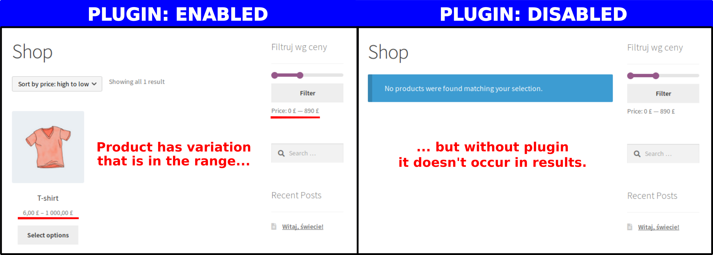

# The Best Price Filter for Woocommerce

Woocommerce implements price filter that cannot search product variation individually! 
This plugin implements better solution to search products through default price filter.

## Official releases

Official release is available [here](https://wordpress.org/plugins/the-best-price-filter-for-woocommerce/).

## Getting started

1. Install and activate Woocommerce.
2. Configure default Woocommerce Price filter widget.
3. Install and activate The Best Price Filter for Woocommerce.
4. That's all!

Thank you for stars and following the plugin repository  [at github](https://github.com/writ3it/wordpress-autoloader-plugin).